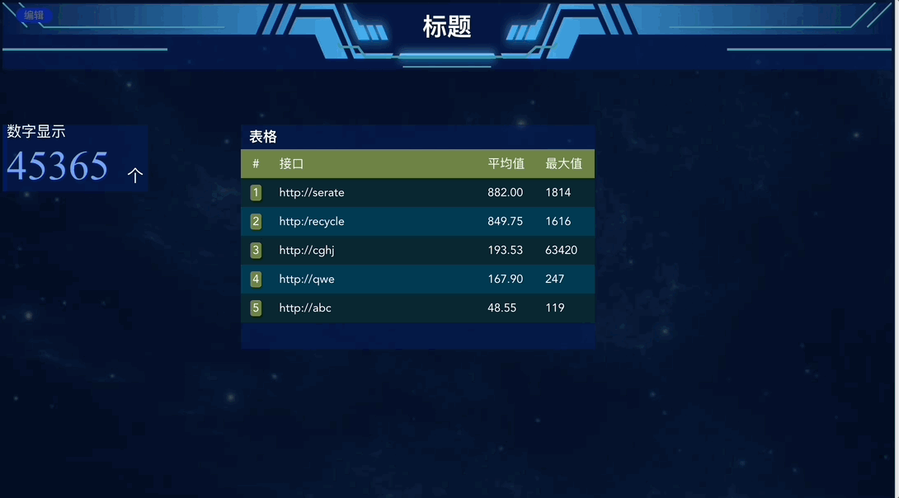
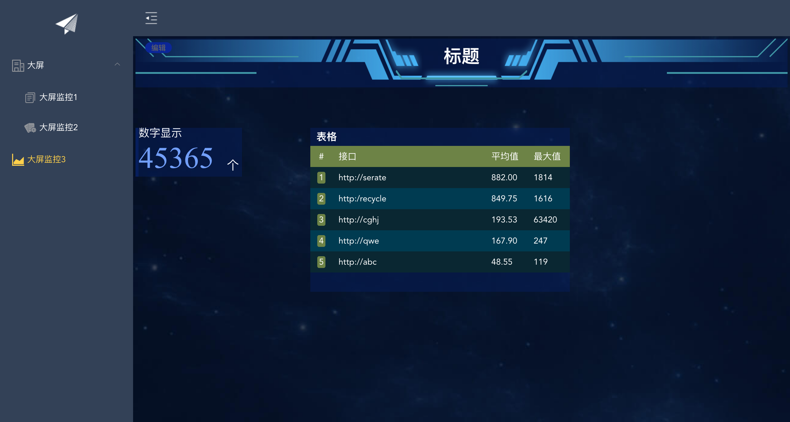
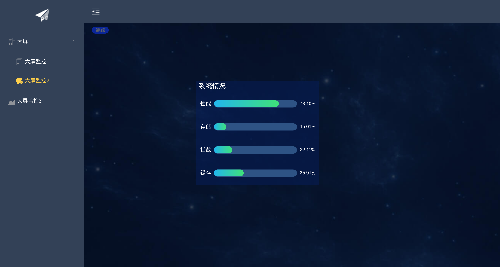
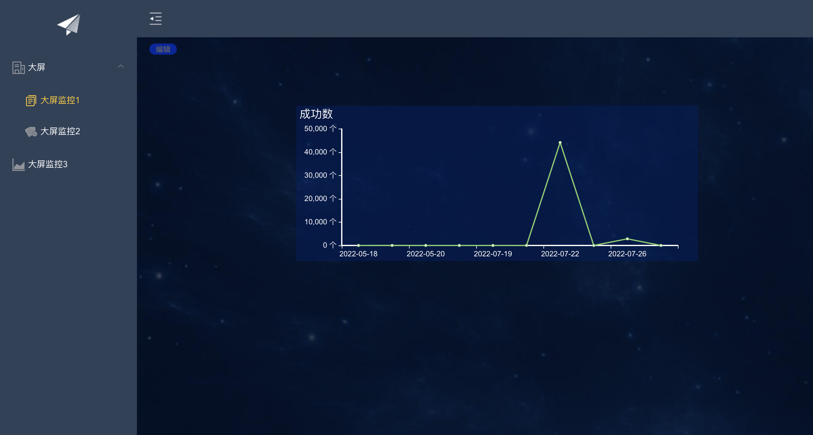

# vue搭建的基于Echarts和vue-grid-layout自定义可拖拽图表式大屏监控
------------------------

#### 预览
  
  
  
  


#### 说明

本项目基于vue-grid-layout栅格布局系统的灵活布局，实现纯前端配置式的图表新增、删除、移动
图表数据设计成来自于第三方接口，接口请求参数直接在弹窗中配置，最终后台服务请求第三方接口获得数据  

vue-grid-layout参考： [栅格布局系统](https://jbaysolutions.github.io/vue-grid-layout/zh/)


#### 目前支持组件

1. 所有echarts类型的图表：[echarts](https://echarts.apache.org/zh/index.html)
2. datav类型的部分图表： [datav](http://datav.jiaminghi.com/guide/)
3. 自定义的数字显示
4. 头部标题(装饰)组件


#### 强调

后台接口数据已经改为mock数据，如需要取消mock接口数据模拟，请把main.js文件中require('./mock')去掉即可

#### 运行项目
------------------------

``` bash
# 下载依赖
npm install

# 中间如果出现mockjs错误，执行以下指令
npm i mockjs -D

# 运行d
npm run dev
```


#### 项目源码地址：
------------------------

码云地址：https://gitee.com/newObjectki/grid-echarts  
github地址：https://github.com/linRickgit/gridEcharts  

